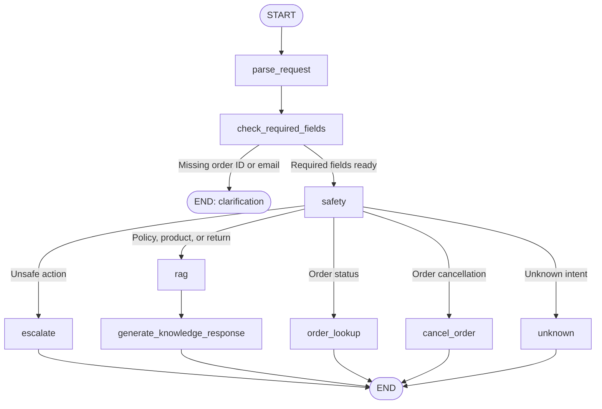

# Footwear Support Agent

A working prototype that answers from approved footwear policies, retrieves
verified order information, persists eligible cancellations, and sends unsafe
requests to a durable local human-review queue. FastAPI provides the API and
Gradio provides the browser interface.

## Architecture

```text
FastAPI / Gradio
       │
       ▼
 shared chat service ── request ID + outcome logging
       │
       ▼
 intent parsing ── confidence gate ── required-field checks
       │
       ▼
 deterministic safety policy
   ├── unsafe action ──► persistent escalation queue
   ├── order action ───► verified JSON order service
   ├── knowledge ──────► Chroma retrieval ─► grounded response
   └── uncertain ─────► clarification
```

Deterministic application code recognizes clear order-status/cancellation flows,
collects requested verification fields across turns, and enforces safety
boundaries. The language model classifies less explicit requests and writes
grounded policy responses; it does not decide whether a sensitive action is
allowed.

### Agent node workflow



Every branch in this diagram corresponds to a node or conditional route in
`app/agent/graph.py`. Unsafe requests terminate through escalation, while
missing identity details terminate with a clarification rather than an action.

## Project structure

```text
app/
├── agent/             # LangGraph state, nodes, and routing
├── llm/               # OpenAI client and prompt helpers
├── rag/               # Policy ingestion and semantic retrieval
├── config.py          # Shared paths and settings
├── chat_service.py    # Shared agent entry point for API and UI
├── main.py            # FastAPI endpoints
├── models.py          # API request and response models
├── ui.py              # Gradio chat interface
├── order_service.py   # Order lookup and cancellation rules
├── escalation_service.py
└── safety.py
data/
├── orders.json
└── policies/
tests/
├── test_orders.py
├── test_nodes.py
├── test_escalations.py
├── test_chat_service.py
└── test_ui.py
```

## Setup

```bash
python -m venv .venv
source .venv/bin/activate
python -m pip install -r requirements.txt
```

Copy your local configuration into `.env` and provide an OpenAI API key:

```dotenv
OPENAI_API_KEY=your-key
OPENAI_MODEL=gpt-5.6-luna
```

Build the local policy index before using knowledge lookup:

```bash
python -c "from app.rag.ingest import ingest; ingest()"
```

## Run

```bash
# uvicorn app.main:app --reload
python -m uvicorn app.main:app --reload
```

Open the browser chat interface at `http://127.0.0.1:8000/ui`.

Interactive API documentation remains available at
`http://127.0.0.1:8000/docs`.

For multi-turn API conversations, send the prior `user` and `assistant`
messages in the optional `history` array:

```json
{
  "message": "alice@example.com",
  "history": [
    {"role": "user", "content": "Check status for ORD-1001"},
    {"role": "assistant", "content": "Please provide your email."}
  ]
}
```

## Test

```bash
python -m pytest
```

The current suite contains 25 deterministic tests. See [TESTING.md](TESTING.md)
for successful cases, discovered failures, and remaining evaluation gaps.

## Assumptions

- All customer and order data is fake prototype data.
- Order ID plus matching email is the prototype verification mechanism; it is
  not sufficient authentication for production.
- A `processing` order is the only state the prototype can automatically
  cancel.
- `data/runtime/escalations.json` represents a durable local review queue, not
  an integration with a real ticketing provider.
- Policy Markdown files are the only approved source for knowledge answers.

## Known limitations

- JSON files and a process-local lock are not safe for multiple server workers.
- Browser follow-ups include a bounded recent transcript so the agent can carry
  forward user-supplied order details. API clients can provide the same context
  through the optional `history` field on `POST /chat`.
- There is no user authentication, rate limiting, tracing backend, or encrypted
  PII store.
- LLM classification and generation remain nondeterministic and depend on the
  configured external model.
- The retrieval cutoff was calibrated against the included sample questions,
  not a statistically meaningful production dataset.
- The local escalation queue does not notify a human automatically.

## Technical judgment questions

### 1. What did you decide was unsafe to automate, and why?

Refunds, compensation, warranty decisions, damaged-item resolutions, duplicate
charges, and delivery-address changes require human review. They involve money,
identity, irreversible consequences, or evidence that this text-only prototype
cannot verify. The model may collect context but cannot approve an outcome.
Cancellation is automated only after exact order-ID/email verification and only
while the stored status is `processing`.

### 2. What would most likely fail first in production, and how would you detect and contain it?

External model or embedding availability and intent misclassification are the
most likely early failures. Every request receives an ID, completion latency and
action are logged, retrieval and generation exceptions are distinguished, and
unexpected workflow errors return a non-sensitive `SERVICE_UNAVAILABLE`
response. Low-confidence intents are converted to clarification instead of an
action. Production monitoring would alert on error rate, latency, escalation
rate, unknown-intent rate, and retrieval-no-match rate.

### 3. What important architecture or product choices did you make, what alternatives did you reject, and what evidence informed those decisions?

The workflow separates probabilistic language tasks from deterministic action
authorization. Direct tool execution by the model was rejected because refund
and identity mistakes have material consequences. Local JSON and Chroma were
chosen for a portable prototype; a database, transaction layer, authenticated
identity provider, and real ticket system are the production alternatives. The
included policies directly informed the high-risk intent list and cancellation
preconditions. See [DECISIONS.md](DECISIONS.md) for the complete log.

### 4. What did an AI tool suggest or generate that you rejected, corrected or improved? How did you identify the problem?

AI-assisted code initially used narrow keyword matching, returned after checking
only the first order, used a Chroma cache path that was not writable, assumed
optional Gradio inputs were strings, rejected relevant retrieval results with an
untested cutoff, and reported cancellation without persisting it. API traces,
manual failure examples, inspection, and regression tests exposed these issues.
Each was corrected rather than accepted because it violated observed behavior or
the system's truthfulness boundary. See [AI_DISCLOSURE.md](AI_DISCLOSURE.md).

### 5. What evidence makes you trust the system today, what remains unproven, and what would you improve first with one additional day?

Twenty-five deterministic tests currently cover identity checks, persistent
cancellation, durable escalation, low-confidence blocking, retrieval failures,
prompt-injection resistance at the action boundary, UI null inputs, and safe
top-level failures. The code also distinguishes knowledge absence from service
failure. Real model quality, concurrency, load, multilingual inputs, and
production identity verification remain unproven. With one more day, the first
improvement would be a labeled end-to-end evaluation set with per-intent recall,
unsafe-action false-positive/negative rates, retrieval recall, and automated
regression reporting.

## Submission packaging

Never include `.env` or generated customer-support runtime data. Create a clean
ZIP with:

```bash
./scripts/package_submission.sh
```

The archive is written under the ignored `dist/` directory.
